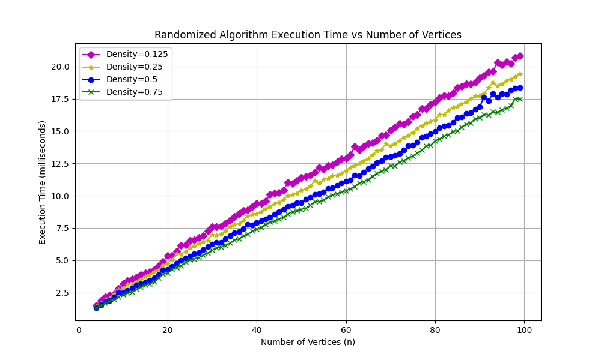
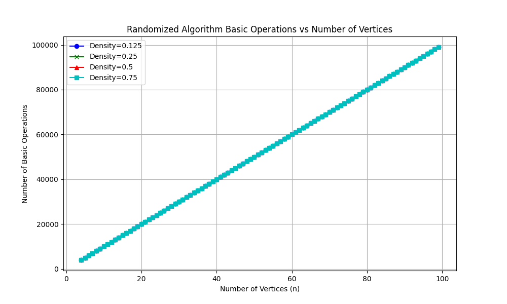
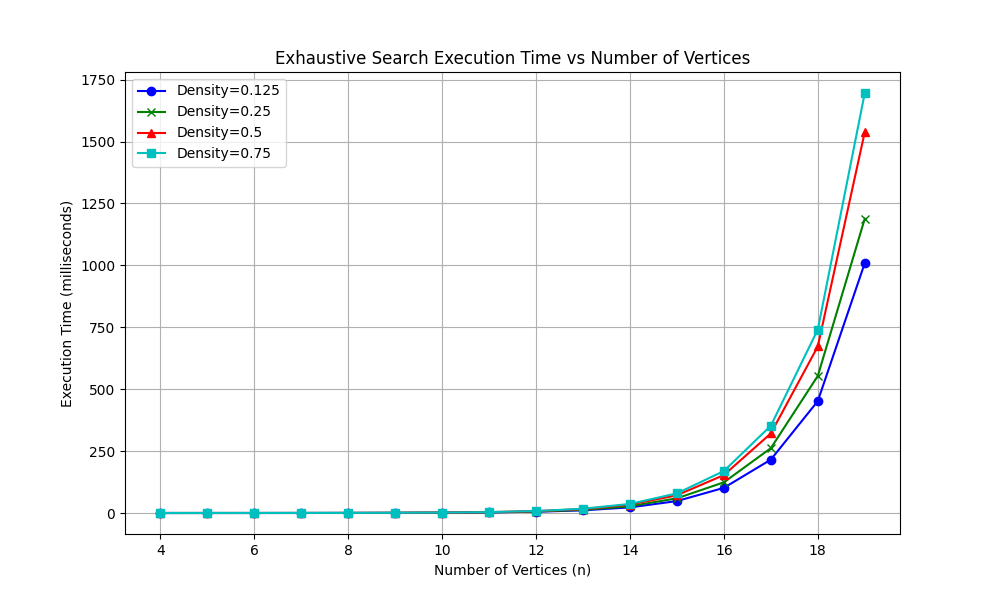
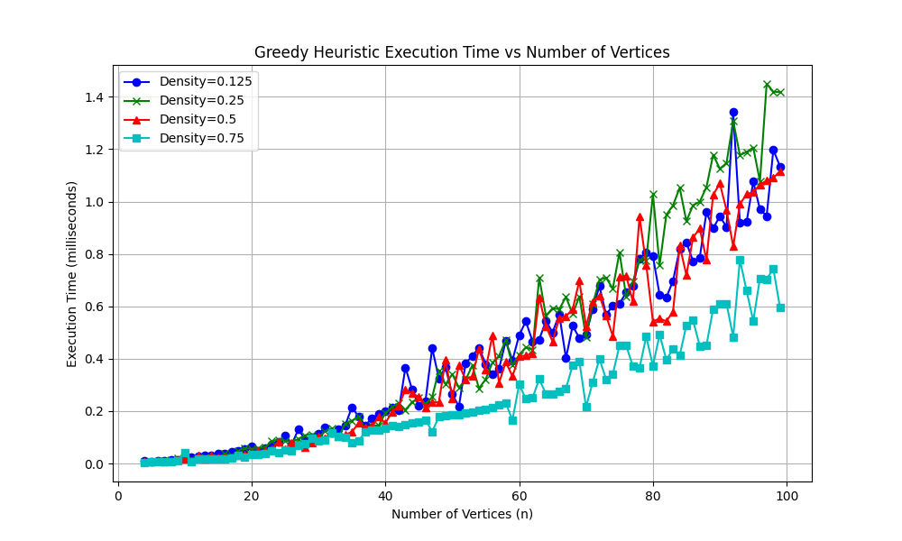

# Minimum Weighted Dominating Set (Graph Optimization Problems)

## Abstract

This project explores the effectiveness of greedy heuristics and randomized search algorithms in solving the **Minimum Weighted Dominating Set (MWDS)** problem on specific graphs and others randomly generated. The MWDS problem is a classic combinatorial optimization challenge with applications in network design, resource allocation, and social network analysis. 

Our approach involves generating undirected graphs with varying sizes and edge densities, assigning random weights to nodes to simulate real-world variability. We implement three algorithms:

- **Exhaustive Search:** Provides the optimal solution by evaluating all possible dominating sets. Due to its computational complexity, this method is feasible only for smaller graphs.
- **Greedy Heuristic:** An approximate method that iteratively selects nodes based on a cost-benefit analysis, significantly reducing computation time at the expense of optimality.
- **Randomized Search:** A novel approach introduced in this project, where vertices are randomly shuffled, and iterative trials are conducted to find a dominating set, improving upon the greedy heuristic by exploring multiple potential solutions.

We conduct experiments across multiple graph sizes and densities (12.5%, 25%, 50%, 75%), using a fixed random seed for reproducibility. The results demonstrate that while the **Exhaustive Search** guarantees optimal solutions, its exponential time complexity limits its practicality to small graphs. The **Greedy Heuristic** offers a balance between solution quality and computational efficiency, making it suitable for larger graphs. The **Randomized Search** further enhances this balance by providing better solution quality than the greedy approach with manageable computational effort, especially in larger and denser graphs.

This project highlights the trade-offs between solution optimality and computational efficiency in solving the MWDS problem. The findings support the use of greedy heuristics and randomized search as viable approaches for large-scale applications, providing a balance between accuracy and resource utilization.

---

## Problem Definition

Given an undirected graph $G(V, E)$  where each vertex $v \in V$ has a positive weight $w(v)$, the goal is to find a **dominating set** $D \subseteq V$  such that the total weight,

$$
\sum_{v \in D} w(v)
$$

is minimized. A dominating set satisfies the condition that every vertex not in $D$  is adjacent to at least one vertex in $D$.

---

## Algorithms Description

### Exhaustive Search

**Exhaustive Search** provides the optimal solution by evaluating all possible dominating sets. Due to its computational complexity, this method is feasible only for smaller graphs.

1. Generate all possible subsets of $V$ .
2. For each subset, check if it is a dominating set.
3. Calculate the total weight of dominating sets.
4. Select the dominating set with the minimum total weight.

### Greedy Heuristic

**Greedy Heuristic** is an approximate method that iteratively selects nodes based on a cost-benefit analysis, significantly reducing computation time at the expense of optimality.

1. Initialize the dominating set $D = \emptyset$ and the set of dominated vertices $S = \emptyset$.
2. While $S \neq V$:
    1. For each vertex $v \notin D$, calculate a heuristic value, e.g.,
    $$ 
    h(v) = \frac{d(v) + 1}{w(v)},
    $$ 
    where $d(v)$ is the number of undominated neighbors.
    2. Select the vertex $v$ with the minimal $h(v)$.
    3. Add $v$ to $D$ and update $S$ by adding $v$ and its neighbors.

### Randomized Search

**Randomized Search** is a new approach introduced in this project, where vertices are randomly shuffled, and iterative trials are conducted to find a dominating set, improving upon the greedy heuristic by exploring multiple potential solutions.

1. Initialize the best solution $BestSolution = \emptyset$.
2. Set the maximum number of iterations $MaxIterations$.
3. Set the maximum computation time $MaxTime$ (measured in milliseconds).
4. For $i = 1$ to $MaxIterations$:
    1. Randomly shuffle the vertex order in $V$.
    2. Initialize an empty candidate solution $CandidateSolution = \emptyset$.
    3. Iterate over the shuffled vertices:
        1. Add a vertex $v$ to $CandidateSolution$ if it is not adjacent to any vertex already in $CandidateSolution$.
    4. If $|CandidateSolution| > |BestSolution|$, update $BestSolution = CandidateSolution$.
    5. If $ElapsedTime > MaxTime$ terminate the algorithm.

---

## Formal Computational Complexity Analysis

### Exhaustive Search

- **Total Subsets:** There are $2^n$ possible subsets for $n$ vertices.
- **Dominating Set Check:** For each subset $D$, verify if every vertex $v \notin D is adjacent to at least one vertex in $D$. This can be done in $\mathcal{O}(n^2)$ time for each subset.
- **Total Complexity:** $\mathcal{O}(2^n \cdot n^2)$.

### Greedy Heuristic

- **Each Iteration:** Calculating $h(v)$ for all $v \notin D$ takes $\mathcal{O}(n)$ time.
- **Total Iterations:** In the worst case, up to $n$ iterations.
- **Total Complexity:** $\mathcal{O}(n^2)$.

### Randomized Search

- **Each Iteration:** Shuffling the vertex order takes $\mathcal{O}(n)$ time. Checking adjacency for each vertex to determine whether it can be added to the candidate solution takes \( \mathcal{O}(n) \) time.
- **Total Iterations:** $MaxIterations$.
- **Total Complexity:** $\mathcal{O}(n^2 \cdot MaxIterations)$.

---

## Computational Experiments

We generated random graphs with varying numbers of vertices $n$ and edge densities (12.5%, 25%, 50%, 75% of the maximum possible edges).

### Graph Generation

The graph generation process involves several key components:

- **Vertices:** Randomly placed points in the 2D plane with integer coordinates between 1 and 1000.
- **Weights:** Assigned as positive values to vertices.
- **Edges:** Added randomly while ensuring the desired edge density and avoiding vertices that are too close to each other.

### Metrics to Measure

The evaluation encompasses several key metrics, including:

- **Number of Basic Operations:** Counts key operations performed by each algorithm.
- **Execution Time:** Measured in milliseconds.
- **Precision of Algorithms:** Compares the weight of the algorithm's solution to the optimal solution obtained from exhaustive search.

---

## Estimating Execution Time for Larger Instances

### Exhaustive Search

Execution time grows exponentially with the number of vertices.

1. **Express $T(n)$ in Terms of an Exponential Function:**
    $$
    T(n) = k \times 2^{n}
    $$
    where $k$ is a constant representing the time taken per basic operation.
2. **Calculate the Ratio of $T(30)$ to $T(16)$:**
    $$
    \frac{T(30)}{T(16)} = \frac{2^{30}}{2^{16}} = 2^{14} = 16384
    $$
3. **Compute $T(30)$ Using the Known Value of $T(16)$:**
    Given $T(16) = 0.125$ seconds:
    $$
    T(30) = 0.125 \text{ seconds} \times 16384 = 2048 \text{ seconds}
    $$

### Greedy Heuristic

Execution time increases quadratically with the number of vertices.

**Suppose:**
- Processing a graph with 1000 nodes takes 0.2 seconds.
- How much time will a graph with 5000 nodes take?

1. **Express $T(n)$ in Terms of a Quadratic Function:**
    $$
    T(n) = k \times n^2
    $$
    where $k$ is a constant representing the time taken per basic operation.
2. **Calculate the Ratio of $T(5000)$ to $T(1000)$:**
    $$
    \frac{T(5000)}{T(1000)} = \frac{5000^2}{1000^2} = 25
    $$
3. **Compute $T(5000)$ Using the Known Value of $T(1000)$:**
    Given $$T(1000) = 0.2$ seconds:
    $$
    T(5000) = 0.2 \text{ seconds} \times 25 = 5 \text{ seconds}
    $$

### Randomized Search

Execution time increases quadratically but may exhibit different behavior due to algorithm parameters.

1. **Express $T(n)$ in Terms of a Quadratic Function:**
    $$
    T(n) = k \times n^2
    $$
    where $k$ is a constant representing the time taken per basic operation.
2. **Calculate the Ratio of $T(10000)$ to $T(1000)$:**
    $$
    \frac{T(10000)}{T(1000)} = \frac{10000^2}{1000^2} = 100
    $$
3. **Compute $T(10000)$ Using the Known Value of $T(1000)$:**
    Given $T(1000) = 0.21$ seconds:
    $$
    T(10000) = 0.21 \times 100 = 21 \text{ seconds}
    $$
    *Note:* In reality, this estimation doesn't correspond to the actual behavior due to parameters that limit the Randomized Search, resulting in significantly lower execution times.

---

## Results and Discussion

### Comparison of Experimental and Formal Analysis

- **Exhaustive Search:**
    - **Expected:** Exponential time complexity $\mathcal{O}(2^n \cdot n^2)$.
    - **Observed:** Execution time grows exponentially with $n$.

- **Greedy Heuristic:**
    - **Expected:** Polynomial time complexity $\mathcal{O}(n^2)$.
    - **Observed:** Execution time increases quadratically with $n$.

- **Randomized Search:**
    - **Expected:** Quadratically time complexity $\mathcal{O}(n^2 \cdot MaxIterations)$.
    - **Observed:** Execution time grows linearly with $n$, as seen in Figure \ref{fig:random_execution_time}. The configuration parameters of the Randomized Search algorithm ensure that its execution time scales linearly with the size of the graph.

  
*Figure: Random Algorithm execution throughout different graph densities

### Impact of Vertex Number on Operation Count

  
*Figure: Random Algorithm Execution Time across different graph densities*

Figure \ref{fig:random_operation_number} displays the number of operations performed by the Random algorithm as graph density increases. Notably, the number of operations remains relatively constant regardless of the graph’s density. This is because the total number of operations is primarily influenced by the number of iterations and the number of vertices, both of which are independent of the graph's edge density. This design ensures that the Random algorithm maintains a consistent operational count even as the complexity of the graph increases, highlighting its scalability.

### Relation Between Execution Time and Graph Density

#### Exhaustive Search

Exhaustive search, though guaranteed to find the optimal solution, quickly becomes impractical as the size and density of the graph increase. Figure \ref{fig:exhaustive_execution_time} illustrates the execution time of the exhaustive algorithm across various graph densities, highlighting a clear trend of rising computation times with increasing density.

The primary reason for this escalation lies in the combinatorial nature of the exhaustive search method. Specifically, the exhaustive algorithm evaluates all possible subsets of vertices to identify the **Minimum Weighted Dominating Set (MWDS)**. The number of such subsets grows exponentially with the number of vertices, following the order of \( 2^n \), where \( n \) is the number of vertices in the graph. As graph density increases, the number of edges rises, leading to a more interconnected graph. This heightened connectivity means that each vertex has more neighbors, thereby increasing the complexity of determining whether a particular subset qualifies as a dominating set.

  
*Figure: Exhaustive Algorithm Execution Time across different graph densities*

#### Greedy Heuristic

**Execution time decreases as graph density increases.** This phenomenon can be understood by examining the balance between:

1. **Per-Iteration Cost Increases with Density:**
    - **Higher Degrees Mean More Neighbors to Process:** In denser graphs, nodes have higher degrees. Computing neighbors that aren't in the dominating set for a node $v$ takes $\mathcal{O}(\text{degree}(v))$ time. So, per iteration, the time may increase with density.

2. **Number of Iterations Decreases with Density:**
    - **Denser Graphs Require Fewer Dominating Nodes:** In dense graphs, a single node can dominate many others due to high connectivity. The dominating set $D$ can be much smaller. Fewer iterations of the outer while loop are needed to dominate all nodes.

As shown in Figure \ref{fig:greedy_execution_time}, execution time decreases because the reduction in iterations outweighs the increase in per-iteration cost.

*Figure: Greedy Algorithm Execution Time across different graph densities*

#### Randomized Search

**Execution time decreases as graph density increases.** This is due to the balance between:

1. **Per-Iteration Cost Increases with Density:**
    - **Higher Node Degrees Lead to More Neighbors to Process:** In denser graphs, nodes possess higher degrees, meaning that each node is connected to more other nodes. This adjacency checking requires $\mathcal{O}(\text{degree}(v))$ time per vertex, increasing per-iteration computational cost.

2. **Number of Iterations Decreases with Density:**
    - **Fewer Dominating Nodes Needed in Dense Graphs:** Dense graphs exhibit high connectivity, allowing a single node to dominate many others. Consequently, the size of the dominating set $D$ is reduced, necessitating fewer iterations of the algorithm to achieve domination of all nodes.

As illustrated in Figure \ref{fig:random_execution_time}, the decrease in execution time required to dominate the graph outweighs the increase in the cost per iteration. Although each iteration may incur a higher computational load as a result of increased node degrees, the overall number of iterations decreases significantly. This results in a net decrease in total execution time as density increases.

### Precision of Algorithms

#### Greedy Heuristic

Table \ref{tab:greedy_exhaustive_comparison} presents a comparison between the Greedy heuristic and Exhaustive search algorithms across various node counts within a graph of fixed density (0.75). The **Ratio (Greedy/Exhaustive)** column serves as a primary indicator of the greedy algorithm's precision relative to the optimal solutions obtained from exhaustive search.

$$
\text{Ratio} = \frac{\text{Greedy Weight}}{\text{Exhaustive Weight}}
$$

A ratio of **1.00** signifies that the greedy heuristic has achieved an optimal solution, perfectly matching the exhaustive search. Ratios exceeding **1.00** indicate instances where the greedy heuristic yields a suboptimal solution, resulting in a higher total weight compared to the exhaustive search. In this case, the greedy heuristic achieved a precision of **88.5%**.

| Number of Nodes | Greedy Weight | Exhaustive Weight | Ratio (Greedy/Exhaustive) |
|-----------------|---------------|-------------------|----------------------------|
| 4               | 11.78         | 11.78             | 1.00 |
| 5               | 17.73         | 13.70             | 1.29 |
| 6               | 10.77         | 10.77             | 1.00 |
| 7               | 4.05          | 4.05              | 1.00 |
| 8               | 4.05          | 2.51              | 1.61 |
| 9               | 2.34          | 2.34              | 1.00 |
| 10              | 6.52          | 5.24              | 1.25 |
| 11              | 1.06          | 1.06              | 1.00 |
| 12              | 6.91          | 5.24              | 1.32 |
| 13              | 6.08          | 6.08              | 1.00 |
| 14              | 5.54          | 5.54              | 1.00 |
| 15              | 4.99          | 4.99              | 1.00 |
| 16              | 4.99          | 4.99              | 1.00 |
| 17              | 4.99          | 4.99              | 1.00 |
| 18              | 8.59          | 5.27              | 1.63 |
| 19              | 5.27          | 5.27              | 1.00 |
| 20              | 5.27          | 5.27              | 1.00 |
| 21              | 6.91          | 6.91              | 1.00 |
| 22              | 7.19          | 7.19              | 1.00 |
| 23              | 10.78         | 7.19              | 1.50 |

#### Randomized Search

The following table presents a comparison between randomized search and exhaustive search algorithms across various node counts within a fixed density graph (0.75). The **Ratio (Random/Exhaustive)** column serves as a primary indicator of the randomized algorithm's precision relative to the optimal solutions obtained from exhaustive search.

$$
\text{Ratio} = \frac{\text{Random Weight}}{\text{Exhaustive Weight}}
$$

A ratio of **1.00** signifies that the randomized search has achieved an optimal solution, perfectly matching the exhaustive search. Ratios exceeding **1.00** (highlighted in red) indicate instances where the randomized search yields a suboptimal solution, resulting in a higher total weight compared to the exhaustive search. In this case, the randomized search achieved a precision of **67%**, substantially less than the greedy heuristic's precision (**88.5%**).

| Number of Nodes | Random Weight | Exhaustive Weight | Ratio (Random/Exhaustive) |
|-----------------|---------------|-------------------|---------------------------|
| 4               | 16.27         | 11.78             | 1.38 |
| 5               | 13.70         | 13.70             | 1.00 |
| 6               | 21.05         | 10.77             | 1.95 |
| 7               | 4.05          | 4.05              | 1.00 |
| 8               | 2.51          | 2.51              | 1.00 |
| 9               | 5.46          | 2.34              | 2.33 |
| 10              | 10.58         | 5.24              | 2.02 |
| 11              | 1.06          | 1.06              | 1.00 |
| 12              | 5.24          | 5.24              | 1.00 |
| 13              | 17.50         | 6.08              | 2.88 |
| 14              | 11.54         | 5.54              | 2.08 |
| 15              | 5.85          | 4.99              | 1.17 |
| 16              | 4.99          | 4.99              | 1.00 |
| 17              | 5.54          | 4.99              | 1.11 |
| 18              | 5.27          | 5.27              | 1.00 |
| 19              | 16.78         | 5.27              | 3.18 |
| 20              | 12.10         | 5.27              | 2.29 |
| 21              | 9.41          | 6.91              | 1.36 |
| 22              | 7.73          | 7.19              | 1.08 |

**Note:** Ratios greater than 1 (red color) indicate that the randomized algorithm's weight exceeds that of the exhaustive search.

### Algorithm Benchmark

The next table summarizes the performance of the three algorithms across different graph instances, highlighting key metrics such as the number of vertices and edges, the best weight achieved, and execution time.

| Graph           | Vertices | Edges   | Algorithm | Best Weight | Execution Time (ms) |
|-----------------|----------|---------|-----------|-------------|---------------------|
| **SWtinyDAG**   | 13       | 15      | Exhaustive | 19.1        | 11.77               |
|                 |          |         | Greedy     | 35.7        | 0.032               |
|                 |          |         | Random     | 21.2        | 3.34                |
| **SW10000EWD**  | 10000    | 123462  | Greedy     | 4850.7      | 20171.76            |
|                 |          |         | Random     | 6447.3      | 2309.90             |
| **SWmediumG**   | 250      | 1273    | Greedy     | 92.1        | 8.54                |
|                 |          |         | Random     | 130.7       | 45.28               |
| **SWmediumEWD** | 250      | 2546    | Greedy     | 92.1        | 8.45                |
|                 |          |         | Random     | 130.7       | 45.37               |
| **SWtinyG**     | 13       | 13      | Exhaustive | 17.9        | 11.60               |
|                 |          |         | Greedy     | 23.6        | 0.02                |
|                 |          |         | Random     | 17.9        | 3.34                |
| **SWmediumDG**  | 50       | 147     | Greedy     | 50.6        | 0.34                |
|                 |          |         | Random     | 32.2        | 10.63               |
| **SW1000EWD**   | 1000     | 16866   | Greedy     | 369.1       | 235.12              |
|                 |          |         | Random     | 451.3       | 217.78              |
| **SWtinyEWD**   | 8        | 15      | Exhaustive | 6.4         | 0.30                |
|                 |          |         | Greedy     | 7.3         | 0.01                |
|                 |          |         | Random     | 6.4         | 2.09                |
| **SWtinyDG**    | 13       | 22      | Exhaustive | 13.9        | 12.35               |
|                 |          |         | Greedy     | 16.4        | 0.02                |
|                 |          |         | Random     | 17.9        | 3.29                |

**Note:** Execution time is measured in milliseconds.

**Observations:**

- **Exhaustive Search:** Achieves the lowest best weights but is computationally expensive, especially as the number of vertices increases.
- **Greedy Heuristic:** Offers the fastest execution times with reasonable solution quality, making it suitable for large graphs.
- **Randomized Search:** Balances between solution quality and execution time, often outperforming the greedy heuristic in terms of solution quality while maintaining manageable execution times.

---

## Conclusion

This study investigated the effectiveness of **greedy heuristics** and **randomized search** algorithms in solving the **Minimum Weighted Dominating Set (MWDS)** problem on randomly generated graphs with varying sizes and densities. By implementing **Exhaustive Search**, **Greedy Heuristic**, and **Randomized Search** algorithms, we analyzed their performance in terms of computational complexity, execution time, and solution precision.

### Key Findings:

- **Exhaustive Search:** 
    - Guarantees optimal solutions by exploring all possible subsets.
    - Exhibits exponential time complexity $\mathcal{O}(2^n \cdot n^2)$, making it impractical for graphs with more than a small number of vertices (up to approximately $n = 25$).
  
- **Greedy Heuristic:** 
    - Efficiently handles larger graphs due to its polynomial time complexity $\mathcal{O}(n^2)$.
    - Provides near-optimal solutions, especially in denser graphs where its precision improves and often matches the optimal solutions obtained from exhaustive search.
  
- **Randomized Search:** 
    - Offers a better balance between solution quality and computational efficiency compared to the greedy heuristic.
    - Scales effectively to larger and denser graphs, maintaining a consistent number of operations irrespective of graph density.
    - Although it does not always achieve optimal solutions, it frequently outperforms the greedy heuristic in terms of solution quality while maintaining manageable execution times.

### Implications:

- **Algorithm Selection:** The choice of algorithm depends on the specific requirements of the application. For scenarios requiring optimal solutions and where computational resources are not a constraint, **Exhaustive Search** is ideal. However, for large-scale applications where efficiency is paramount, **Greedy Heuristic** and **Randomized Search** offer viable alternatives.
  
- **Scalability:** **Randomized Search** demonstrates strong scalability, maintaining consistent operational counts and decreasing execution times as graph density increases. This makes it particularly suitable for applications involving large and complex networks.

### Future Work:

Attempts to apply the current algorithms to extremely large graphs (e.g., $n = 1,000,000$ vertices) revealed significant scalability limitations. For instance, the Greedy algorithm was estimated to take approximately 55.5 hours to complete on such large-scale problems, rendering it impractical. This underscores the need to explore alternative algorithms or optimization techniques that can handle massive graphs more efficiently.

---
